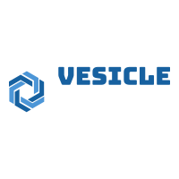

# vesicle

[![NPM Version][npm-image]][npm-url]
[![Node Version][node-image]][node-url]

<div style="text-align:center"></div>

RPC framework

## Installation

```bash
npm i vesicle -S
```

## Usage

- typescript

```typescript
// server
import { Action, Factory, Module, Service } from '../src/decorator';

@Service()
class Book {
  @Action()
  hi() {
    console.log('hello');
  }

  @Action()
  hi2() {
    throw new Error('asdad');
  }

  @Action()
  hello() {
    return 'hello';
  }
}

@Module([Book])
class AppModule {}

function bootstrap() {
  const app = Factory.create(AppModule);
  app.listen(6960);
}

bootstrap();

// client
import { Client } from '../src/client';

const myclient = new Client({
  url: '172.19.2.10:6960,172.19.2.10:6971,192.168.1.61:6960
});


myclient
  .call('book.hi')
  .then(ret => {
    console.log(ret);
  })
  .catch(err => {
    console.error(err);
  });
```

- javascript

```javascript
import { Server } from '../src/server';
import { responseTime, LRU } from '../src/middleware';

const server = new Server({ nodeID: 'node1' });

server.addAction({
  name: 'list',
  handler: () => {
    console.log(1);
  }
});

server.addAction({
  name: 'book.hello',
  handler: () => {
    return 'hello';
  }
});

server.addAction({
  name: 'book.hi',
  handler: async () => {
    await sleep(1000);
    return 'sleep hi';
  },
  use: responseTime
});

server.addAction({
  name: 'book.cache',
  handler: async () => {
    await sleep(5000);
    return 'cache book';
  },
  use: [responseTime, LRU]
});

server.addAction({
  name: 'book.hi2',
  handler: async () => {
    throw new Error('hi2');
  }
});

function sleep(delay = 1000) {
  return new Promise(resolve => setTimeout(resolve, delay));
}

server.listen(6960);
```

## API

### server

.addAction( action: Action | Handler, service?: string, version?: string ): boolean

add a defined funtion

### client

.call(action: string,parameter?: any,options: CallOptions = { retry: this.retry }): Promise<any>

invoke a remote funtion

## Todo

- [ ] xxx

## License

MIT

[npm-image]: https://img.shields.io/npm/v/vesicle.svg
[npm-url]: https://www.npmjs.com/package/vesicle
[node-image]: https://img.shields.io/badge/node.js-%3E=8-brightgreen.svg
[node-url]: https://nodejs.org/download/
